I break applications, APIs, mobile binaries, cloud infrastructure and network boundaries, with **40+ security assessments** behind me. Research is the other half of what I do, and what I do best: figuring out systems I've never seen before, from mobile apps to custom binaries and protocols.

**[Portfolio](https://0xl33n.github.io/)** · **[Writeups](https://0xl33n.github.io/writeups/)** · **[LinkedIn](https://www.linkedin.com/in/neel929/)**

### `$ cat featured.md`

**[Practical Guide to Reverse Engineering Flutter Applications →](https://0xl33n.github.io/writeups/flutter-reverse-engineering/)** 
Recovering function names with reFlutter, restoring references to Dart objects from a heap dump, and fixing the Dart VM stack so Ghidra can decompile Flutter apps on iOS and Android.

### `$ cat ~/experience.log`

- **Security Engineer** @ Bureau Veritas Cybersecurity (formerly Security Innovation) · Aug 2023 – Jan 2026 
  Security assessments of web, cloud and mobile services, threat model reviews, manual code review, and custom Burp and Scapy tooling.
- **M.S. Computer Science** @ The University of Texas at Dallas · 2021 – 2023

### `$ cat ~/awards.txt`

- **NSA Codebreaker Challenge 2022:** solved all 9 of 9 challenges, covering reverse engineering, forensics, network protocols, cryptanalysis and vulnerability research.

### `$ cat stack.txt`

`Burp Suite` `Ghidra` `IDA Pro` `Frida` `LLDB` `Wireshark` `Nmap` `Scapy` `Docker` `AWS`
`Python` `C/C++` `Assembly` `Swift` `Objective-C` `Go` `Rust` `Java` `JavaScript`
