I break applications, APIs, mobile binaries, cloud infrastructure and network boundaries, with **40+ security assessments** behind me. Research is the other half of what I do, and what I do best: figuring out systems I've never seen before, from mobile apps to custom binaries and protocols.

  &nbsp;
  &nbsp;
  

